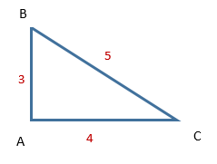

```{r, include = FALSE}
knitr::opts_chunk$set(
  collapse = TRUE,
  comment = "#>"
)
df_format1 <- data.frame (point1  = c(1,3,1,4,4,4),
                          point2 = c(2, 2,3,1,2,3),
                          distance = c(2.1, 7.3,4,2.5,2.3,6))
df_incomplete <- data.frame (point1  = c(1,3,4,4),
                          point2 = c(2, 2,1,2),
                          distance = c(2.1, 7.3,2.5,2.3))
df_format2 <- data.frame (object1  = c("Sun","Sun","Earth"),
                          object2 = c("Earth", "Mars","Mars"),
                          distance = c(150,228,55))
library(dist2location)
```

Imagine you have set of points, but you know only distances between them 
(distances for all their possible pairs). *dist2location* package can be used 
to find the location of all points. 

Of course there are infinity solutions in cartesian coordinate system 
(with some big enough k dimension) but it's enough to find one. Rest of them 
can be found by symmetry transformation, rotation or shifting points by vector. 

# Distance Matrix concept
One of the basic concept used during working with *dist2location* package is 
*distance matrix*. For set of n points enumerated by {1,2, ..., n} distance 
matrix is built as square matrix with n rows and columns. Row (and column) with 
index i is related with i-th point. Matrix element indexed by (i,j) includes 
distance between i-th and j-th points. 

Of course distance from i-th to j-th point should be equal to distance from 
j-th to i-th point (opposite direction) so upper and lower triangle matrices 
should be symmetrical. Additionally diagonal should include only zeros, because 
distance between point and itself is 0. There are more limitations related with 
metrics, see chapter "Validation distance matrix". 

## Example 1
Let's consider pythagorean triangle with edges lengths 3,4 and 5. 



If we enumerate three vertices  A, B, C as 1,2,3 following distance matrix 
describes distances between them:
```{r}
matrix(c(0,3,4,
        3,0,5,
        4,5,0),3,3)

```

## Example 2
Let's consider tetrahedron (triangular pyramid where all edges have the same 
length). In this example we assume edge length is equal to 7. For such 
symmetrical case it doesn't matter how do we enumerate vertices, distance 
matrix is defined for them as: 
```{r}
matrix(c(0,7,7,7,
        7,0,7,7,
        7,7,0,7,
        7,7,7,0),4,4)
```
# Create distance matrix
One can prepare distance matrix by using matrix() function (see examples 
above). If you have cases in form (point1,point2,distance between them) you can 
build data frame for them and use create_distance_matrix() function to prepare 
distance matrix. 

There are two different formats of data frame which can be used as an input. 

If we have set of anonymous points, we can enumerate them and data frame will 
include 3 columns of numeric type, first two will include indexes of points, 
third distance between them. In following example first row includes 
information: distance between points with indexes 1 and 2 is equal to 2.1

```{r}
df_format1

create_distance_matrix(df_format1)
```
If data frame doesn't includes cases (distances) for all possible pairs 
(points) combinations, missing values in output matrix will be marked as NA.
```{r}
df_incomplete

create_distance_matrix(df_incomplete)
```

If names for points are defined one can prepare data frame when first two 
columns includes characters (and points are identified by their names). 
```{r}
# Distances in 10^6 km
df_format2

create_distance_matrix(df_format2)
```
# Distance Matrix validation 
Distance matrix should be a square matrix and no NA nor negative values should 
be included. Additionally three axioms defined for metric space should be 
fulfilled (lets denote d(x,y) as distance between points x and y):

1. d(x,y) = 0  <=> x = y
2. d(x,y) = d(y,x)
3. d(x,z) <= d(x,y) + d(y,z) , so informally: "direct" distance from x to z is 
not bigger then distance from x to z via point y.

Function *is_distance_matrix_ok()* can be used for validation:
```{r}
library(dist2location)
m_ok <- matrix(c(0,7,7,7,
                 7,0,7,7,
                 7,7,0,7,
                 7,7,7,0),4,4)

is_distance_matrix_ok(m_ok)
m_rule2_broken <- matrix(c(0,7,7,7,
                           2,0,7,7,
                           7,7,0,7,
                           7,7,7,0),4,4)
is_distance_matrix_ok(m_rule2_broken)
```
If we want to check what is wrong with second matrix, there is also function 
for debuging:
```{r}
debug_distance_matrix(m_rule2_broken)
```
# Repair distance matrix
When distance matrix is wrong, still can be repaired by repair_distance_matrix 
function. It can make matrix square, remove NA, negative numbers, correct 
first, second and third metric rules. It tries to change original matrix as 
lass as possible to fulfill all distance matrix requirements. 
```{r}
# repair matrix with value
# Notify, Upper triangular part overwrites lower triangular part of matrix (rule 2)
m_rule2_broken

repair_distance_matrix(m_rule2_broken)

# Let's make distance matrix for tetrahedron with edge = 1
tetrahedron <- matrix(rep(1,16),4,4)
tetrahedron

tetrahedron <- repair_distance_matrix(tetrahedron)
tetrahedron

```
